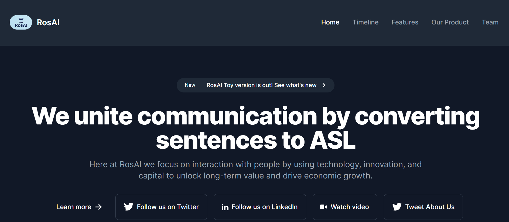

# Revolution of Speaking : ROS AI

>This project is the first protype which was submitted in BuildSpace S4. This project primarily converts any text to ASL Sign Lanaguages.




# Contributing

Thanks for your interest in contributing! Please read carefully through our guidelines below to ensure that your contribution adheres to our project's standards.

## Code of Conduct

To hold a safe space for all contributors, we expect all project participants to adhere to our Code of Conduct. Please read the [code of conduct](CODE_OF_CONDUCT.md) so that you can understand what actions will and will not be tolerated.

## Issue Tracking

We use [GitHub Issues](https://github.com/srummanf/ROS-AI/issues) to track all tasks related to this project.

To help you get your feet wet and get you familiar with our contribution process, we have [a list of friendly issues](https://github.com/srummanf/ROS-AI/issues?q=is%3Aissue+is%3Aopen+label%3A%22good+first+issue%22) that contain tasks which are fairly easy to fix. This is a great place to get started.

**We will not accept contributions with linting errors.**

This is a [Next.js](https://nextjs.org/) project bootstrapped with [`create-next-app`](https://github.com/vercel/next.js/tree/canary/packages/create-next-app).


## Build the project locally

In order to contribute to a project on GitHub, you must first get a copy of the project running locally on your computer. This process is sometimes called a "build process", and every project's process will have different requirements. Some requirements are due to the project being hosted on GitHub, some are due to the programming language used, some are due to the project's dependencies.

There are five steps to building this project:

1. [Set up Git](#set-up-git)
1. [Fork the repository](#fork-the-repository)
1. [Clone your fork](#clone-your-fork)
1. [Install dependencies](#install-dependencies)
1. [Run the project](#run-the-project)


This project uses [`next/font`](https://nextjs.org/docs/basic-features/font-optimization) to automatically optimize and load Inter, a custom Google Font.

Once you get the project built, see if you can fix some [issues](https://github.com/srummanf/ROS-AI/issues?q=is%3Aissue+is%3Aopen+label%3A%22good+first+issue%22).

### Set up Git

> **If you've never written JavaScript before, don't sweat!** This exercise only requires fundamental language skills, you should be able to adapt from your favorite language.

All Github projects are backed by a version control software called *Git*.


### Fork the repository

A *fork* is a copy of a repository. Forking a repository lets you to make changes to your copy without affecting any of the original code.

Click **Fork** (in the top-right corner of the page) to copy this repository to your GitHub account.

### Clone your fork

A *clone* is a downloaded version of a repository. Cloning our fork lets you download a copy of the repository to your computer.

Use `git` to clone your fork

```
$ git clone https://github.com/YOUR-USERNAME/ROS-AI.git

```

### Install dependencies

Did you know that the author usually does not write all of the code in a project?

The beauty of open source is that you can install and use code that other people have written, allowing you to focus on the unique requirements of your project. Third-party code that your project installs is called a *dependency* because it is required to work.

This project uses [npm](https://www.npmjs.com/), a command-line tool bundled with Node.js, to maintain third-party dependencies.

First, navigate into the project's directory

```
$ cd ROS-AI
```

Next, use `npm` to install the project' dependencies
```
$ npm install
```

### Run the project

First, run the development server:

```bash
npm run dev
# or
yarn dev
# or
pnpm dev
```

Open [http://localhost:3000](http://localhost:3000) with your browser to see the result.

You can start editing the page by modifying `app/page.js`. The page auto-updates as you edit the file.

## Submit a Pull Request

Remember how making changes on a *fork* doesn't affect the original code? Well, in order to fix an issue in the main project, you *want* to change the original code. A *pull request* is a GitHub feature that lets you do just that!

There are three steps to submitting a pull request:
1. [Save your changes locally](#save-your-changes-locally)
2. [Send your changes to your fork](#send-your-changes-to-your-fork)
3. [Open a Pull Request](#open-a-pull-request)


### Save your changes locally

First, get a list of all the files you have changed.
```
$ git status
```

Next, *stage* the file you want to save. This will add the file to a new list that is ready to be saved.
```
$ git add .
```

Next, verify that the file has been staged correctly. Notice that the text color has changed, and your file is now in a list that says "Changes to be committed" instead of "Changes not staged for commit"
```
$ git status
```

Finally, save your staged files.
```
$ git commit -m "implement_"
```

You'll often hear this process called *committing* changes. It's the exact same thing.

### Send your changes to your fork

With one simple `git` command, you can send the changes you just committed locally to your *fork* on GitHub.

```
$ git push origin "branch_name"
```

### Open a Pull Request

1. Find the [New Pull Request](https://github.com/srummanf/ROS-AI/compare/) button
2. Select the option to **compare across forks**
3. Select **your username** in the `head fork` option
4. Select **author** in the `base` option
5. Click **Create Pull Request**


## Learn More

To learn more about Next.js, take a look at the following resources:

- [Next.js Documentation](https://nextjs.org/docs) - learn about Next.js features and API.
- [Learn Next.js](https://nextjs.org/learn) - an interactive Next.js tutorial.

You can check out [the Next.js GitHub repository](https://github.com/vercel/next.js/) - your feedback and contributions are welcome!

Check out our [Next.js deployment documentation](https://nextjs.org/docs/deployment) for more details.

